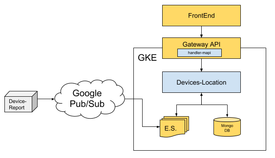
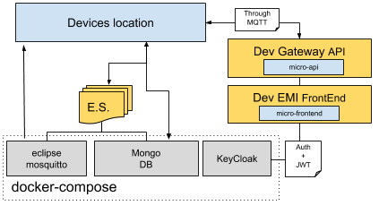

# Devices Location MicroService
The general purpose of this service is to listen events received through the event store which reference to the device (Information centered on the device status and its location). Each one of these events is formated to create a persistent device status and a device location history. At the end, all of this information is exposed on the web page through a GraphQL API.
   
_This MicroService is built on top of NebulaE MicroService Framework.  Please see the [FrameWork project](https://github.com/NebulaEngineering/nebulae) to understand the full concept_**.



# Table of Contents
  * [Project Structure](#structure)
  * [FrontEnd](#frontend) - not yet available  
    *  [Environment variables](#frontend_env_vars) - not yet available  
  * [API](#api)
    * [GraphQL throught Gateway API](#api_gateway_graphql)
  * [BackEnd](#backend)
    *  [Devices Location](#backend_devices_location)
        *  [Environment variables](#backend_devices_location_env_vars)
        *  [Event Sourcing](#backend_devices_lcoation_eventsourcing)
        *  [CronJobs](#backend_devices_location_cronjobs)
  * [Prepare development environment](#prepare_dev_env)


# Project structure <a name="structure"></a>

```
.
├── frontend                            => Micro-FrontEnds - not yet available  
│   └── emi                             => Micro-FrontEnd for [EMI FrontEnd](https://github.com/nebulae-tpm/emi) - not yet available  
├── api                                 => Micro-APIs  
│   └── gateway                         => Micro-API for [Gateway API](https://github.com/nebulae-tpm/gateway)  
├── backend                             => Micro-BackEnds  
│   └── devices-location                => Micro-BackEnd responsible for Handling devices events (Events that reference to the device status and its location) published by devices-report
├── etc                                 => Micro-Service config Files.  
│   └── mapi-setup.json                 => Micro-API setup file  
├── deployment                          => Automatic deployment strategies  
│   ├── compose                         => Docker-Compose environment for local development  
│   └── gke                             => Google Kubernetes Engine deployment file descriptors  
├── .circleci                           => CircleCI v2. config directory
│   ├── config.yml
│   └── scripts
├── docs                                => Documentation resources  
│   └── images  
├── README.md                           => This doc
```

# API <a name="api"></a>
Exposed interfaces to send Commands and Queries by the CQRS principles.  
The MicroService exposes its interfaces as Micro-APIs that are nested on the general API.  

## GraphQL throught Gateway API <a name="api_gateway_graphql"></a>
These are the exposed GraphQL functions throught the [Gateway API](https://github.com/nebulae-tpm/gateway).  

Note: You may find the GraphQL schema [here](api/gateway/graphql/device-location/schema.gql)

### GraphQL Queries

#### getDevicesLocation(filterText: String, groupName: String, limit: Int)
Gets the devices data and the location of each device. 

**filterText:** If the filterText filter is applied, the devices will be filtered by serial or hostname of the device.

**groupName:** If the groupName filter is applied, this query will return only the devices belonging to the specified group name.

**limit:** If a limit is entered, the query will return the maximum number of documents specified.

#### getDeviceGroups
Gets the device group names registered on the platform

### GraphQL Subscriptions

#### deviceLocationEvent(ids: [String])
Event fired when a device is modified or when a device reports information about its location.

**ids:** Indicates the IDs of the devices of which you want to receive events. If no IDs are specified, all the devices will be listened.

### GraphQL Mutations

N/A

# BackEnd <a name="backend"></a>
Backends are defined processes within a docker container.  
Each process is responsible to build, run and maintain itself.  

Each BackEnd has the following running commands:
  * npm start: executes main program
  * npm run prepare: execute maintenance routines such DB indexes creation
  * npm run sync-state:  syncs backend state by reading all missing Events from the event-store
  * npm test: runs unit tests

## Devices location <a name="backend_devices_location"></a>
All the time, the Device report microservice reports events belonging to the different devices registered on the system, these events detail information about the device status.  The Device location backend gathers these events and persists the relevant information for this microservice (Eg. hostname, groupName, location, alarms, etc). At the end, all of the received information become in two main persisted states: General status of each device and a device location history.

### Environment variables <a name="backend_devices_location_env_vars"></a>

```
+------------------------------------------+--------+----------------------------------------------------------------------------------------------+-------+-----------+
|                 VARIABLE                 | TYPE   |                                          DESCRIPTION                                         |  DEF. | MANDATORY |
|                                          |        |                                                                                              | VALUE |           |
+------------------------------------------+--------+----------------------------------------------------------------------------------------------+-------+-----------+
| production                               | bool   | Production enviroment flag                                                                   | false |           |
+------------------------------------------+--------+----------------------------------------------------------------------------------------------+-------+-----------+
| EVENT_STORE_BROKER_TYPE                  | enum   | Event store broker type to use.                                                              |       |     X     |
|                                          | string | Ops: PUBSUB, MQTT                                                                            |       |           |
+------------------------------------------+--------+----------------------------------------------------------------------------------------------+-------+-----------+
| EVENT_STORE_BROKER_EVENTS_TOPIC          | enum   | Event store topic's name.                                                                    |       |     X     |
|                                          | string |                                                                                              |       |           |
+------------------------------------------+--------+----------------------------------------------------------------------------------------------+-------+-----------+
| EVENT_STORE_STORE_TYPE                   | enum   | Event store storage type to use.                                                             |       |     X     |
|                                          | string | Ops: MONGO                                                                                   |       |           |
+------------------------------------------+--------+----------------------------------------------------------------------------------------------+-------+-----------+
| EVENT_STORE_STORE_URL                    | string | Event store storage URL or connection string.                                                |       |     X     |
|                                          |        | Eg.: mongodb://127.0.0.1:27017/test                                                          |       |           |
+------------------------------------------+--------+----------------------------------------------------------------------------------------------+-------+-----------+
| EVENT_STORE_STORE_AGGREGATES_DB_NAME     | string | Event store storage database name for Aggregates                                             |       |     X     |
|                                          |        | Eg.: Aggregates                                                                              |       |           |
+------------------------------------------+--------+----------------------------------------------------------------------------------------------+-------+-----------+
| EVENT_STORE_STORE_EVENTSTORE_DB_NAME     | string | Event store storage database name prefix for Event Sourcing Events                           |       |     X     |
|                                          |        | Eg.: EventStore                                                                              |       |           |
+------------------------------------------+--------+----------------------------------------------------------------------------------------------+-------+-----------+
| GOOGLE_APPLICATION_CREDENTIALS           | string | Production only.                                                                             |       |     X     |
|                                          |        | Google service account key path to access google cloud resources.                            |       |           |
|                                          |        |                                                                                              |       |           |
|                                          |        | Eg.: /etc/GOOGLE_APPLICATION_CREDENTIALS/gcloud-service-key.json                             |       |           |
+------------------------------------------+--------+----------------------------------------------------------------------------------------------+-------+-----------+
| LOCKVERSION                              | string | Production only.                                                                             |       |     X     |
|                                          |        | word or phrase used to evaluate if the sync task should be run before starting this backend. |       |           |
|                                          |        | This value must be changed to force state sync task.                                         |       |           |
+------------------------------------------+--------+----------------------------------------------------------------------------------------------+-------+-----------+
| MONGODB_URL                              | string | Materialized views MONGO DB URL                                                              |       |     X     |
|                                          |        | Eg.: mongodb://127.0.0.1:27017/test                                                          |       |           |
+------------------------------------------+--------+----------------------------------------------------------------------------------------------+-------+-----------+
| MONGODB_DB_NAME                          | string | Materialized views MONGO DB name                                                             |       |     X     |
|                                          |        | Eg.: DevicesLocation                                                                         |       |           |
+------------------------------------------+--------+----------------------------------------------------------------------------------------------+-------+-----------+
| JWT_PUBLIC_KEY                           | string | RSA Public key to verify JWT Tokens.                                                         |       |     X     |
|                                          |        | Format: -----BEGIN PUBLIC KEY-----\nPUBLIC_KEY\n-----END PUBLIC KEY-----                     |       |           |
+------------------------------------------+--------+----------------------------------------------------------------------------------------------+-------+-----------+
| REPLY_TIMEOUT                            | number | TimeOut in milliseconds in case of sending data through the broker and waiting the response. |  2000 |           |
+------------------------------------------+--------+----------------------------------------------------------------------------------------------+-------+-----------+
| BROKER_TYPE                              | enum   | Broker type to use for inter-process communication.                                          |       |     X     |
|                                          | string | Ops: PUBSUB, MQTT                                                                            |       |           |
+------------------------------------------+--------+----------------------------------------------------------------------------------------------+-------+-----------+
```

#### Notes: 
  * ENV VARS for development are [here](backend/devices-location/.env)
  * ENV VARS for production are [here](deployment/gke/deployment-devices-location.yaml)

### Event Sourcing <a name="backend_devices_lcoation_eventsourcing"></a>
Event sourcing events this Micro-BackEnd is subscribed to or is publishing

#### Subscribed events:
  * DeviceDeviceStateReported: device main footprint reported/changed
  * DeviceLocationReported: device location data reported/changed
  * DeviceRamuUsageAlarmActivated: Device RAM usage alarm activation due to exceeding configured threshold
  * DeviceRamUsageAlarmDeactivated: Device RAM usage alarm deactivation due to falling behind configured threshold
  * DeviceSdUsageAlarmActivated: Device SD usage alarm activation due to exceeding configured threshold 
  * DeviceSdUsageAlarmDeactivated: Device SD usage alarm deactivation due to falling behind configured threshold
  * DeviceCpuUsageAlarmActivated: Device CPU usage alarm activation due to exceeding configured threshold 
  * DeviceCpuUsageAlarmDeactivated: Device CPU usage alarm deactivation due to falling behind configured threshold
  * DeviceTemperatureAlarmActivated: Device TEMPERATURE alarm activation due to exceeding configured threshold 
  * DeviceTemperatureAlarmDeactivated: Device TEMPERATURE alarm deactivation due to falling behind configured threshold
  * DeviceConnected: Device connected or dinsconnected reported/changed
#### Published events:
  * N/A

### CronJobs <a name="backend_devices_location_cronjobs"></a>
Time-based jobs that are configured and triggered by the [CronJob MicroService](https://github.com/nebulae-tpm/ms-cronjob)

#### Clean device location history
Cleans the location history of each device registered on the system. Keeps the N last locations reported by a device where N is configured on the cronjob properties.

specs:  
  * Event type: CleanDeviceLocationHistoryJobTriggered
  * Payload properties: 
     * keepLastNLocations (int): Number of locations to keep by device

#### Clean group names
Finds and removes the group names that are not being used by any device.

specs:  
  * Event type: CleanGroupNamesJobTriggered
  * Payload properties: 
     * N/A

# Prepare development environment <a name="prepare_dev_env"></a>

